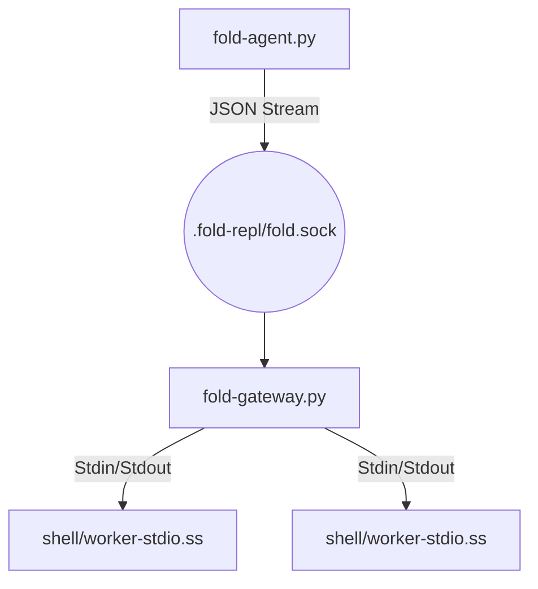

# The Fold Socket Gateway (FSG)

This document describes the new **Socket Gateway** architecture for The Fold, which replaces the legacy file-based polling mechanism for Agent <-> REPL interaction.

## 🚀 Quick Start

### 1. Start the Gateway Daemon
The gateway must be running for agents to interact with the system.

```bash
# Run in the background
nohup ./fold-gateway.py > gateway.log 2>&1 &

# Or run in foreground for debugging
./fold-gateway.py
```

### 2. Run an Agent Command
Use the updated `fold-agent.py` client to send Scheme expressions.

```bash
./fold-agent.py "(+ 1 2)"
# Output: 3
```

## 🏗 Architecture

The system has moved from a "dead drop" file polling model to a **supervisor process** model using Unix Domain Sockets.



### Key Components

1.  **`fold-gateway.py` (The Supervisor)**
    *   **Role:** Manages the lifecycle of Scheme worker processes.
    *   **Tech:** Python `asyncio`.
    *   **Function:** Accepts connections on `.fold-repl/fold.sock`. When a client connects with a `session_id`, the gateway either finds an existing worker or spawns a new one. It then proxies JSON messages between the client and the worker.
    *   **Cleanup:** Automatically kills workers that have been idle for 5 minutes.

2.  **`shell/worker-stdio.ss` (The Runtime)**
    *   **Role:** Executes Scheme code.
    *   **Tech:** Chez Scheme.
    *   **Function:** Reads a JSON object from `stdin`, evaluates the `code` field, and prints JSON lines to `stdout`.
    *   **Improvement:** No longer handles file locking, polling, or session management. It is a pure "Request -> Response" pipe.

3.  **`fold-agent.py` (The Client)**
    *   **Role:** User/Agent interface.
    *   **Tech:** Python.
    *   **Function:** Connects to the socket, sends the request, and streams the response to the user.

## 📡 Protocol

Communication is entirely **newline-delimited JSON**.

### Request (Client -> Gateway -> Worker)
```json
{
  "id": "req-123",
  "session": "agent-session-abc",
  "code": "(define x 10) (+ x x)"
}
```

### Response Stream (Worker -> Gateway -> Client)
The worker emits multiple JSON lines.

**Standard Output (e.g. `(display ...)`):**
```json
{"id": "req-123", "type": "stdout", "chunk": "Calculating...\n"}
```

**Standard Error:**
```json
{"id": "req-123", "type": "stderr", "chunk": "Warning: something happened\n"}
```

**Final Result:**
```json
{"id": "req-123", "type": "result", "value": "20", "cost": 0}
```

**Error:**
```json
{"id": "req-123", "type": "error", "message": "Exception: variable 'y' not bound"}
```

## 🛠 Troubleshooting

**"Gateway socket not found"**
*   Ensure `fold-gateway.py` is running.
*   Check if `.fold-repl/fold.sock` exists.

**"Worker crashed" / "Worker EOF"**
*   Check `gateway.log`. The gateway logs the `stderr` of all worker processes.
*   Common causes: Syntax errors in `shell/worker-stdio.ss` or missing dependencies.

Permissions
*   Ensure `fold-gateway.py`, `fold-agent.py`, and `shell/worker-stdio.ss` are executable (`chmod +x ...`).

## 🗑 Legacy Cleanup
The following files are deprecated and can be removed once the migration is fully verified:
*   `daemon.sh`
*   `start-daemon.ss`
*   `shell/repl-daemon-mcp.ss`
*   `shell/repl-worker.ss`

```